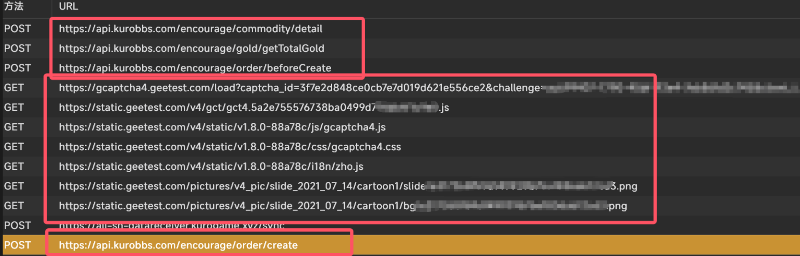
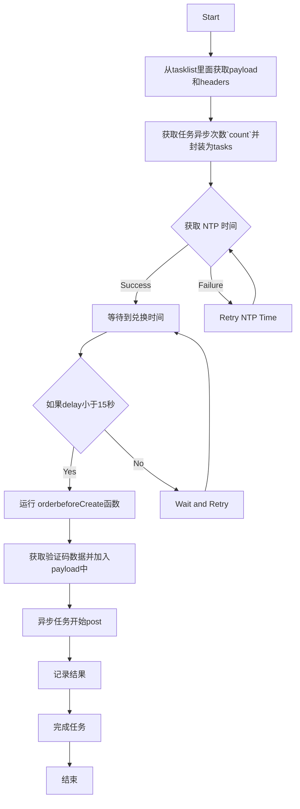

# 商品兑换逻辑

## 库街区原始逻辑
- ### 兑换流程
- 如图：

- **流程1**：当点进去商品详细信息后，首先获取商品详细信息和拥有的总`gold`数目，然后post给`https://api.kurobbs.com/encourage/order/beforeCreate`,获取默认地址，然后获取验证码(不管到没到兑换时间都会获取验证码)，流程1结束
- **流程2**：如果时间到了，即可开始兑换，post给`https://api.kurobbs.com/encourage/order/create`

以下是关于 `https://api.kurobbs.com/encourage/order/create` 接口的请求和响应格式：

### 请求说明

### URL

`https://api.kurobbs.com/encourage/order/create`

### 请求方法

`POST`

### 请求头

```json
{
    "devcode": "devcode",
    "ip": "你的ip",
    "source": "android",
    "version": "2.2.1",
    "versioncode": "2210",
    "token": "token",
    "osversion": "Android",
    "distinct_id": "distinct_id",
    "countrycode": "CN",
    "model": "2203121C",
    "lang": "zh-Hans",
    "channelid": "2",
    "content-type": "application/x-www-form-urlencoded",
    "content-length": "261",
    "accept-encoding": "gzip",
    "cookie": "user_token="+token,
    "user-agent": "okhttp/3.11.0"
}
```

### 请求参数

请求体为 `application/x-www-form-urlencoded` 格式，包含以下字段：

| 字段名         | 类型   | 说明                      |
| -------------- | ------ |------------------------- |
| commodityCode  | string |商品代码                  |
| commodityNum   | number |商品数量                  |
| geeTestData    | string |极验测试数据              |
| province       | string |省份                      |
| city           | string |城市                      |
| area           | string |区域                      |
| detail         | string |详细地址                  |
| mobile         | string |手机号码                  |
| receiver       | string |接收者                    |
| gameId         | number |游戏ID  2为战双帕弥什3为鸣潮                  |


## 响应说明

### 响应体

响应体为 JSON 格式，包含以下字段：

| 字段名  | 类型   | 说明                       |
| ------- | ------ | -------------------------- |
| code    | number | 响应状态码                 |
| msg     | string | 响应信息                   |
| success | bool   | 请求是否成功               |

### 响应示例

失败响应示例(暂时没有成功的,库洛币不够)：

```json
{
    "code": 101,
    "msg": "商品不在销售状态，无法购买",
    "success": false
}
```

## 错误码说明

| 错误码 | 说明                   |
| ------ | ---------------------- |
| 101    | 商品不在销售状态，无法购买 |
| 200    | 请求成功               |


## 程序兑换逻辑


注意，由于不知道验证码机制，目前方案是一个payload然后异步并发`count`次数


